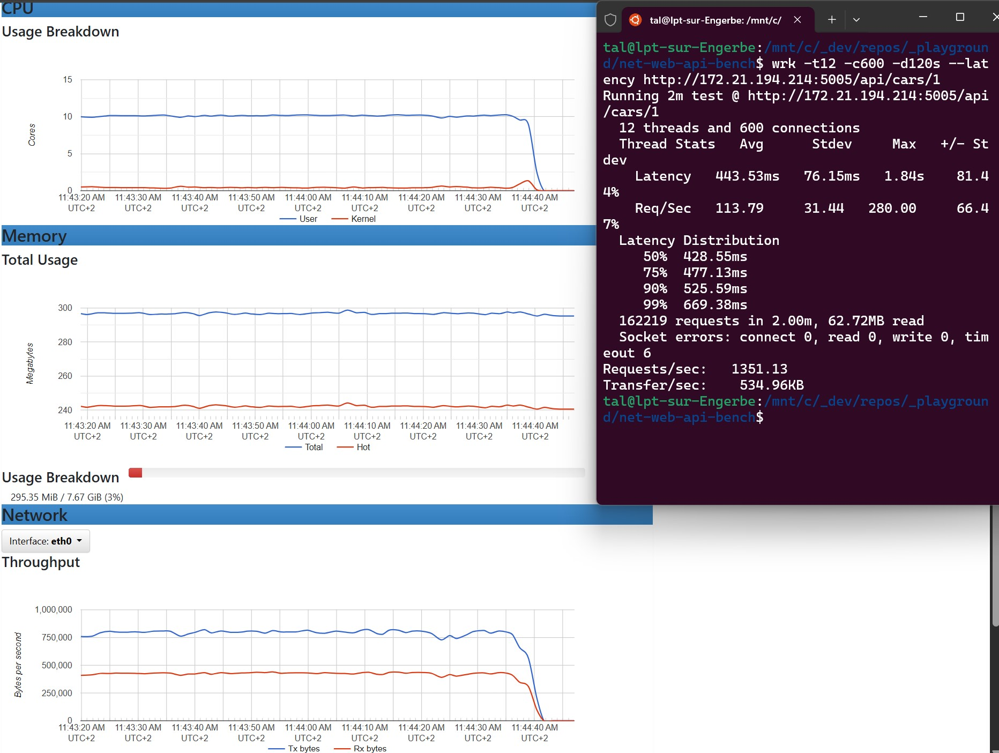
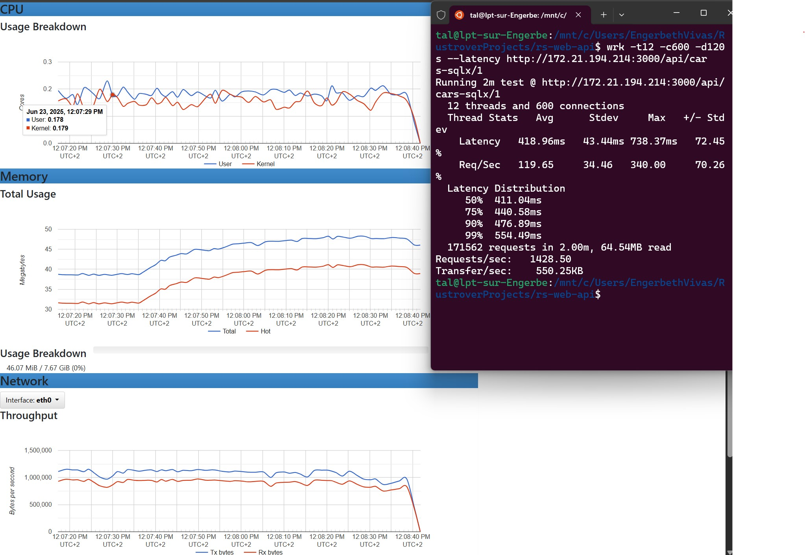
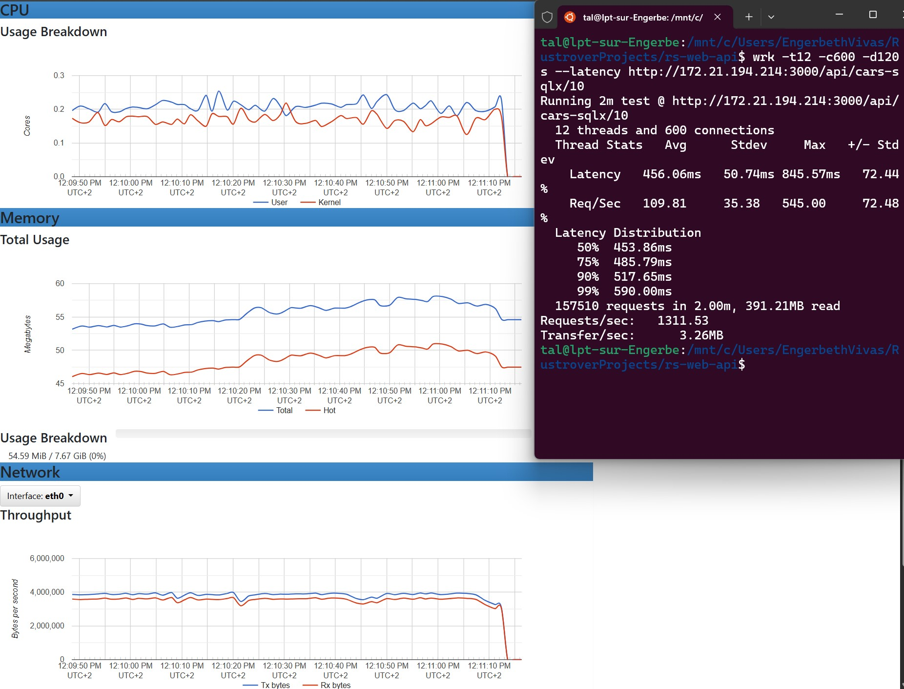
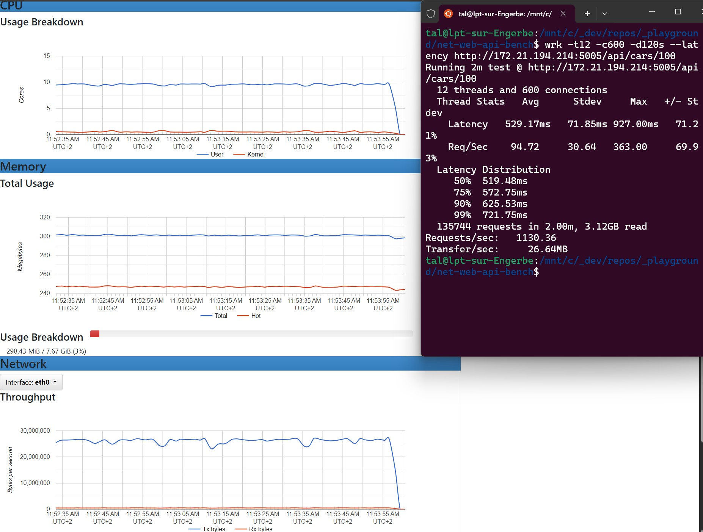
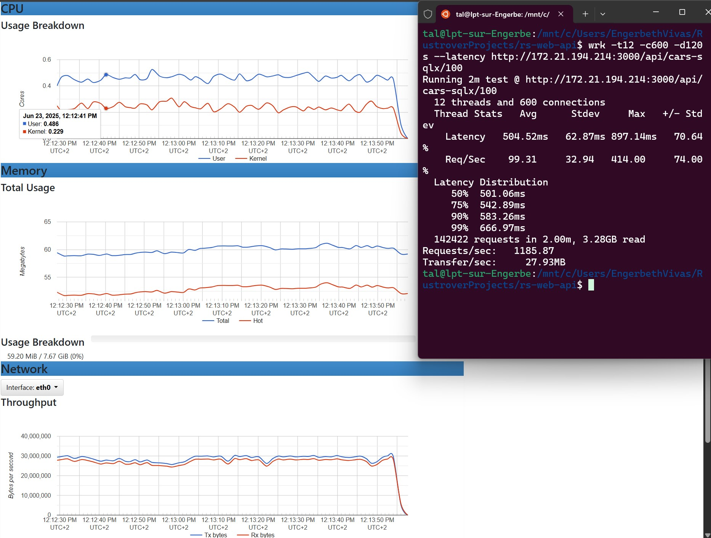
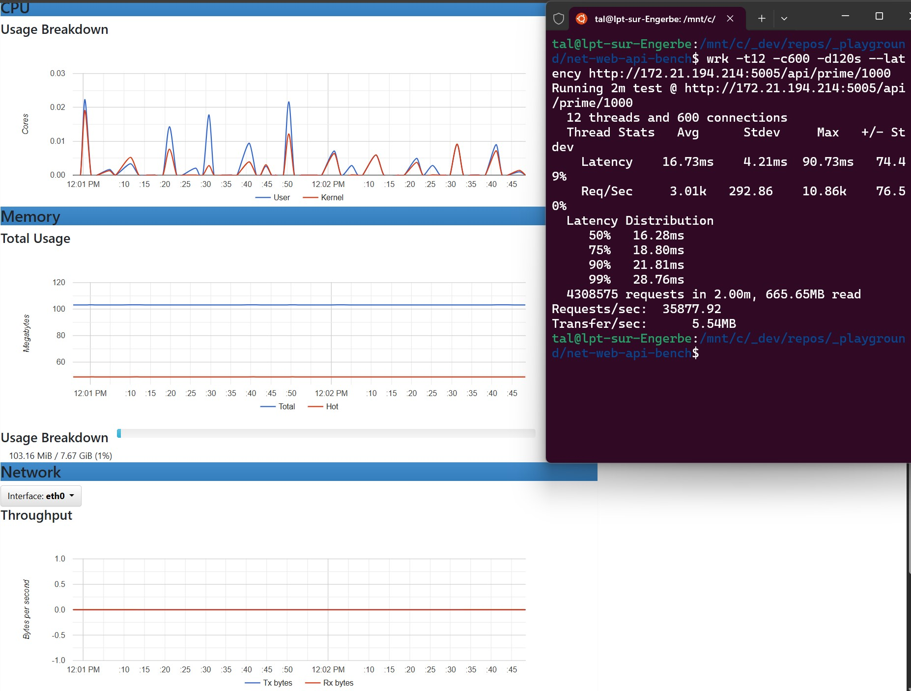
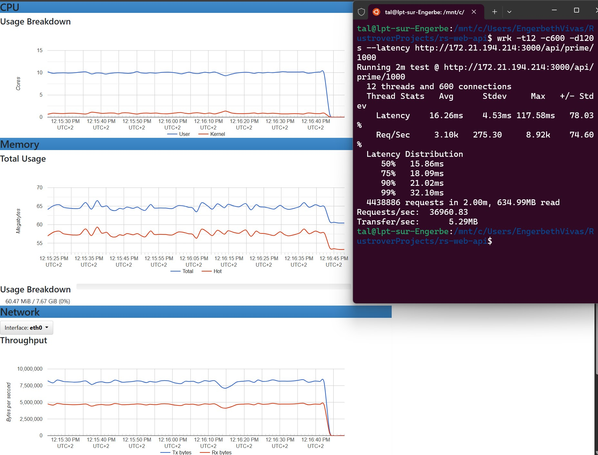

# Rust Axum Sqlx vs .Net8 Dapper benchmark

## Results
- Web API request 1 random car
  - Net8: 
  - Axum: 
- Web API request 10 random cars
  - Net8: 
  - Axum: 
- Web API request 100 random cars
  - Net8: 
  - Axum: 
- Web API request 1000th prime
  - Net8: 
  - Axum: 
